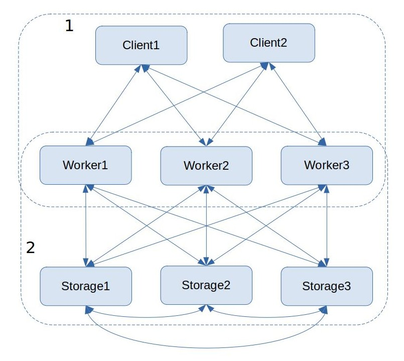

# brood-scrapper

Scrapper distribuido que dado un conjunto de dominios web y una profundidad realiza scrapping a estos hasta dicha profundidad.

#

Autores:
- Samuel David Suárez Rodríguez, C412 - [@samueldsr99](github.com/samueldsr99)
- Enmanuel Verdesia Suárez, C411 - [@svex99](github.comm/svex99)

#

## Arquitectura

El sistema esta constituido por tres tipos de nodos:

- **Client:** Carga las urls a analizar y las probee a los workers.
- **Worker:** Recibe las urls de los clientes y consulta la disponibildad de estas en los nodos storage para evitar tener que hacer una peticion web vía http, el resultado lo devuelven a los clientes y si fue necesario hacer scrapping, dado que no estaba *cacheada* la petición, se le envía la actualización a los nodos de almacenamiento.
- **Storage:** Procesan las consultas a caché de los workers y responden con el contenido, si es un *hit*, o no, en caso contrario. Propagan las actualizaciones a los demás nodos de almacenamiento.

El descubrimiento en la red es mediante grupos multicast y cada nodo se adapta a la cantidad de nodos disponibles del tipo que necesita. Estableciendo una relación de necesidad o dependencia entre los nodos se puede decir que los clientes dependen de los workers y estos de los storage, pero no de forma absoluta porque el sistema continúa funcionando sin nodos de almacenamiento, realizando los workers las consultas directo a la web.



### Conexiones Client - Worker

En la imagen se observa el grupo multicast 1, en este cada worker envía beacons con su id y el puerto por el que está escuchando, por tanto los clientes que escuchan en ese grupo pueden saber la disponibilidad de workers en la red, conectarse a los que encuentren y desconectarse de los que después de cierto intervalo de tiempo no den señales de vida.

Al un ciente conectarse a un worker se establece una conexión entre sockets zmq de tipo DEALER (cliente) -> ROUTER (worker), esto ofrece la ventaja de que al un cliente conectarse a más de un worker, el cliente se encargue del balanceo de carga en las peticiones que hace.

### Conexiones Worker - Storage

En el grupo multicast 2 cada nodo storage envía beacons de igual forma con su id y puerto por el que escucha las conexiones de los workers. De igual forma al caso anterior la conexión se establece entre DEALER (worker) -> ROUTER (storage) lo que garantiza balanceo de carga en las peticiones a los diferentes storages.

Cuando un worker realiza el scrapping a una dirección web, esto fue o bien porque no había servicio de almacenamiento disponible o bien porque se consultó previamente y no tenia la información, entonces se necesita enviar un update a los nodos de almacenamiento. Este update se envía en un solo mensaje y solo a uno de los storage disponibles (esto lo selecciona el socket de manera interna), el storage que lo reciba es el encargado de propagarlo a los demás para mantener la consistencia entre las réplicas.

### Conexiones Storage - Storage
En el mismo grupo multicast 2 van a estar escuchando los nodos de almacenamiento. De esta forma descubren los otros nodos del mismo tipo que hay en la red, los que deben hacerle llegar las updates de los workers. Es decir cada vez que un nodo storage recibe un update de un worker la propaga a los demás.

Adicionalmente permite que cuando un nodo de almacenamiento entre al sistema le pueda solicitar la información a otro nodo y así replicarla localmente para que en caso de que aquel nodo muera no se pierda la información almacenada.


### Mensajes a los grupos multicast

- **worker**: `'w <worker_id> <worker_port>'`
- **storage:** `'s <storage_id> <storage_port>'`

Estos mensajes tienen toda la información necesaria para establecer la conexión entre los nodos. Si un nodo deja de enviar estos mensajes se asume, después de cierto intervalo de tiempo, que no esta disponible. De igual forma si los mensajes cambian la dirección de origen y/o puerto en el payload, pero no el identificador, se asume que el nodo es el mismo y se actualiza su dirección.

### Request/Response messages

- Request from client to worker

    ```json
    {
        "id": "client-id",
        "url": "www.example.com"
    }
    ```

- Response from worker to client

    ```json
    {
        "url": "www.example.com",
        "hit": true,  // or false
        "content": "<h1>html code for www.example.com</h1>"
    }
    ```

- Request from worker to storage

    ```json
    {
        "id": "client-id",
        "url": "www.example.com"
    }
    ```

- Rsponse from strorage to worker

    ```json
    {
        "id": "client-id",
        "url": "www.example.com",
        "hit": true,  // or false
        "content": "<h1>html code for www.example.com</h1>"
    }
    ```

- Update from worker to strorage

    ```json
    {
        "url": "www.example.com",
        "content": "<h1>html code for www.example.com</h1>",
        "spread": true
    }
    ```

- Update cache request

    ```json
    {
        "id": "storage-id",
        "new": true,
        "updateme": true  // or false
    }
    ```

- Update from storage to storage

    ```json
    {
        "url": "www.example.com",
        "content": "<h1>html code for www.example.com</h1>",
        "spread": false
    }
    ```

# Instrucciones para ejecutar el ejemplo

El proyecto viene listo para ser ejecutado en docker.

Lo primero que se debe hacer es construir la imagen, para esto es necesario estar en la raíz del proyecto y ejecutar el siguiente comando:

```cmd
docker image build -t brood-scrapper .
```

Luego es necesario crear un volumen y nombrarlo `urls`, en ese volumen se van a colocar los ficheros de texto con las direcciones web que hay q analizar. Para hacer esto ejecutar el comando:

```cmd
docker volume create urls
```

Una vez esto hecho solo hay que ejecutar el comando:

```cmd
docker-compose up -d
```

Este comando según el `docker-compose.yml` va a levantar tres nodos de tipo storage (`storage1`, `storage2`, `storage3`), luego va levantar tres nodos de tipo worker (`worker1`, `worker2`, `worker3`) y dos clientes (`client1`, `client2`) que van a hacer requests. Estos nodos van a estar en la misma red (`brood-net`).

Para comprobar el estado de cada uno de estos contenedores se puede ejecutar el comando:

```cmd
docker logs <nombre> -f
```

Cuando los clientes `client1` y `client2` terminen su ejecución deben tener en los volúmenes `result1` y `result2` respectivamente los resultados devueltos por los nodos de tipo worker a sus consultas.

Luego de esto cada nodo de almacenamiento `storage1`, `storage2`, `storage3` deben tener almacenada una copia de la caché en los volúmenes `cache1`, `cache2` y `cache3` respectivamente.

Estos volúmenes anterioremente citados se puede verificar en el sistema de archivo de Linux bajo la dirección `/var/lib/docker/volumes`.

## Añadiendo nodos al sistema

### Nodos de tipo cliente

Para añadir un cliente puede usar el comando

```
docker container run --rm -it --name <nombre> -v urls:/app/urls -v <res-vol>:/app/result --net brood_net --ip <ip-del-contenedor> brood-scrapper <comando>
```
donde `<nombre>` es el nombre que se desea dar al contenedor, `<res-vol>` el volumen donde almacenar los resultados devueltos por los workers, la dirección IP debe estar en la subred `172.30.10.0/24` y `<comando>` es el comando de inicio para ejecutar un cliente, siguiendo la estructura:
```
usage: run_client.py [-h] --ip IP [--file FILE] [--n N]

optional arguments:
  -h, --help   show this help message and exit
  --ip IP      Interface IP address
  --file FILE  File with URLs to be loaded
  --n N        Max number of URLs to load. Use -1 for all
```
Donde el IP debe coincidir con la dirección IP que se pasó como parámetro al contenedor.

Opcionalemnte se puede usar `-d` en lugar de `-it`.

Un ejemplo concreto sería el siguiente:

```
docker container run --rm -d --name new_client -v urls:/app/urls -v new_results:/app/result --net brood_net --ip 172.30.10.88 brood-scrapper python run_client.py --ip 172.30.10.88 --file urls/new_urls.txt
```

### Nodos de tipo worker

La instrucción a ejecutar sería de la forma:

```
docker container run --rm -it --name <nombre> --net brood_net --ip <ip-del-contenedor> brood-scrapper <comando>
```
donde `<nombre>` es el nombre que se le quiere asignar al contenedor, la IP la dirección que tendrá el conetnedor en la subred `172.30.10.0/24` y`<comando>` el comando de inicio siguiendo el formato:

```
usage: run_worker.py [-h] --ip IP [--port PORT]

optional arguments:
  -h, --help   show this help message and exit
  --ip IP      Interface IP address
  --port PORT  Port to bind
```
y donde la dirección ip debe coincidir con la asignada al contenedor en la red.

El parámetro `-it` puede ser reemplazado por `-d`.

Ejemplo concreto de uso:
```
docker container run --rm -d --name new_worker --net brood_net --ip 172.30.10.98 brood-scrapper python run_worker.py --ip 172.30.10.98 --port 6000
```

### Nodos de tipo storage

Para añadir un nodo storage se puede seguir el formato siguiente:

```
docker container run --rm -it --name <nombre> -v <cache_name>:/app/cache --net brood_net --ip <ip-del-contenedor> brood-scrapper <comando>
```

donde `<nombre>` es el nombre que tedrá el contenedor, `<cache_name>` es el nombre del volumen donde se persistirá el caché, la IP es la que tendrá el contenedor en la subred `172.30.10.0/24` y el comando es el de inicio, siguiendo el formato siguiente:

```
usage: run_storage.py [-h] --ip IP --port PORT [--cache CACHE] [--update]

optional arguments:
  -h, --help     show this help message and exit
  --ip IP        Interface IP address
  --port PORT    Port to listen workers connections
  --cache CACHE  Cache folder path
  --update       If present this storage will update his cache
```
y donde la dirección ip debe coincidir con la asignada al contenedor en la red. La bandera `--update` solo debe usarse si se conoce que hay otro nodo en la red, cuya caché hasta ese punto del tiempo, se desea replicar. Lo normal sería levantar el primer storage sin ella, y los posteriores con ella, para mantener todas las réplicas sincronizadas. Nótese que las actualizaciones de caché una vez que los nodos están levantados se propagan independientemente de si se replica en el inicio o no del nodo. Y una vez que un nodo se une, puede atender solicitudes para replicar la caché de otro nodo nuevo con la flag `--update`.

El parámetro `-it` puede ser reemplazado por `-d`.

Ejemplo concreto de uso:
```
docker container run --rm -d --name new_storage -v new_cache:/app/cache --net brood_net --ip 172.30.10.108 brood-scrapper python run_storage.py --ip 172.30.10.108 --port 6000 --cache cache --update
```

## Eliminar nodos del sistema

Para eliminar un nodo ejecutandose en el container `<nombre-contenedor>` solo es necesario ejecutar el comando:

```
docker container rm -f <nombre-contenedor>
```

Si se desea consultar los nodos antes de eliminarlo:
```
docker logs <nombre-contenedor> -f
```

Para eliminar todos los nodos creados con `docker-compose` ejecutar:
```
docker-compose down
```
